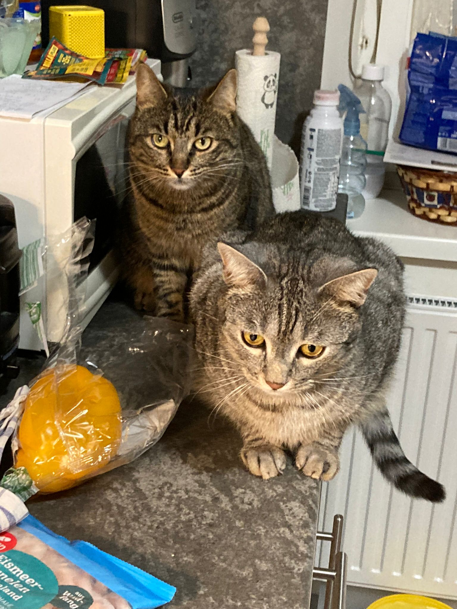

# Moha and Chili

## What is this?

This is a simple file about my two cats, Moha and Chili.
It contains no instructions, only some information about both of them.

## Who are they?

Chili is a female brown tabby cat, that loves to cause all kinds of mischief,
including but not limited to:
- Stealing food
- Knocking things over
- Biting toes whenever possible

Moha is her brother, and usually the quieter one of the two.
Although he is bigger in size, he is a lot more timid than his sister.
He loves to sleep, especially in the basket on the cat tree.

They are both very adorable, and I am glad they are in my life.
And even though they are a lot of work, I wouldn't trade them for anything.

## What do they look like?

I'm glad you asked! Here is a picture of them!

## What else do I need to know?

There is not much that needs to be said, but if you want to know more about them,
don't hesitate to ask me! I am also happy to provide more pictures upon request.