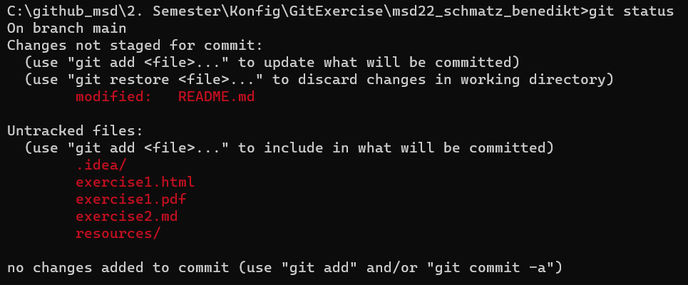
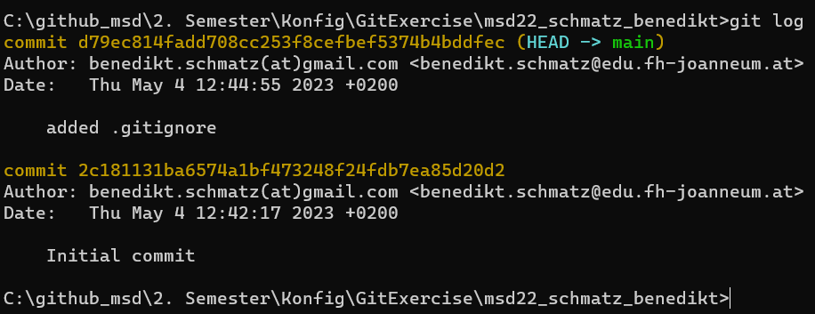

# Exercise 2 - git

## What is git?

Git is used for version control. Changes to files are tracked, and can be reverted to a previous state if necessary. It is also used to collaborate with other people on the same project, as it allows for easy sharing of code.

## Why use git?

Git is incredibly useful for easily keeping track of all changes. In the case of a mistake, it is easy to revert to a previous version of the code. 

## How to use git?

Git is used through the command-line. The most important commands are:

- git config
   - get or set global/user-specific options

- git init
   - create an empty git repository named after the standard branch

- git commit
   - record changes to the repository and set a point that can be reverted to

- git status
   - display the state of the working directory and the staging area
   - 

- git add
   - add file that are not tracked yet to the staging area

- git log
   - display past commits and their messages
   - 

- git diff
   - show changes between commits

- git pull
   - get the latest version of a repository from a remote repository

- git push
   - push the latest local version of a repository to a remote repository

There are also some applications that can be used to make using git easier, such as [GitHub Desktop](https://desktop.github.com/).

