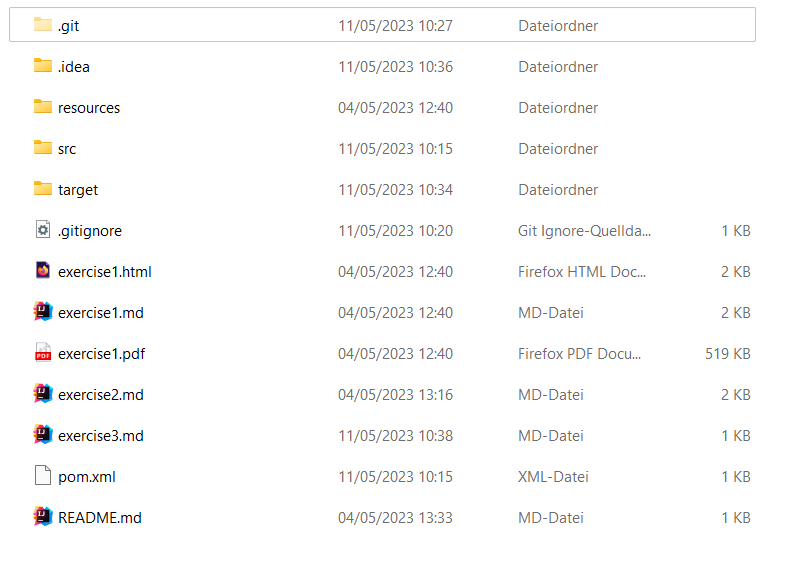
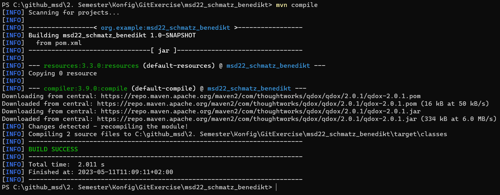

# Exercise 3 - Maven

## What is Maven?

Maven is a build automation tool used primarily for Java projects. It is used to manage dependencies, and to build and test projects.

## What happens after the main method is called?

After running the main method for the first time, a folder called "target" is created. See the image below:

## Using mvn compile

This is the message that appeared after running `mvn compile`:

